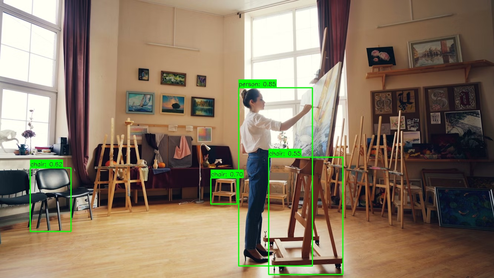

# Object Detection with YOLOv8

  


A Python implementation of object detection using YOLOv8 model pretrained on the COCO dataset. Detects 80 common object categories and draws bounding boxes with labels and confidence scores.

## Features

- 🖼️ Input image processing with OpenCV and PIL
- 🔍 Object detection using YOLOv8 (nano/small/medium/large/xlarge variants)
- 📦 Automatic model download on first run
- 🎯 Configurable confidence threshold
- 💾 Save results or display them interactively
- 🐍 Clean, well-documented Python code

## Prerequisites

- Python 3.8+
- pip package manager

## Installation

1. Clone the repository:
```bash
git clone https://github.com/your-username/object-detection-yolov8.git
cd object-detection-yolov8
```

2. Create and activate a virtual environment (recommended):
```bash
python -m venv venv
source venv/bin/activate  # On Windows: venv\Scripts\activate
```

## Usage

Basic Usage
```python
python object_detection.py
```

Custom Option
```python
python object_detection.py \
    --input "path/to/your/image.jpg" \
    --output "output.jpg" \
    --conf 0.5  # Confidence threshold (0-1)
```

## Acknowledgments

Ultralytics for YOLOv8 implementation

COCO dataset for pretrained models

OpenCV for image processing
